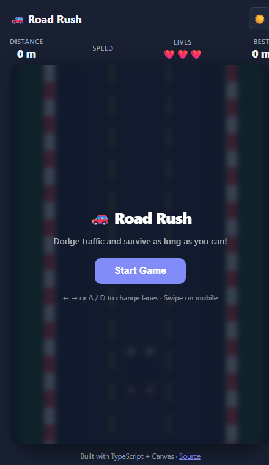

# 🚗 Road Rush — 2D Car Game

A fast-paced top-down 2D car dodging game built with **TypeScript** and the **HTML5 Canvas API**. Dodge oncoming traffic, survive as long as possible, and beat your personal distance record.

---

## Overview



Drive your car down a three-lane highway. Traffic spawns from the top of the screen and accelerates over time. Lose a life every time you collide — run out of lives and it's game over. Your best distance is saved automatically between sessions.

### Controls

| Platform | Left | Right |
|----------|------|-------|
| Keyboard | ← Arrow / A | → Arrow / D |
| Mobile | ◀ on-screen button | ▶ on-screen button |
| Touch | Swipe left | Swipe right |
| Start / Restart | Enter or Space | — |

### Mechanics

| Feature | Detail |
|---------|--------|
| Lives | 3 — shown as ❤️ hearts |
| Invincibility | 110 frames (~1.8 s) after each hit |
| Score | Counted in metres (frames ÷ 6) |
| Speed ramp | `speed = min(18, 3.5 + frame × 0.004)` |
| Persistence | Best score saved to `localStorage` |

---

## Architecture

### Tech stack

| Layer | Technology |
|-------|-----------|
| Language | TypeScript 5.7 (strict) |
| Rendering | HTML5 Canvas 2D API — no libraries |
| Bundler | Vite 6 |
| Styling | CSS custom properties (light/dark theme) |
| State | Module-level variables + `requestAnimationFrame` loop |

### Module layout

| File | Responsibility |
|------|---------------|
| `src/car.ts` | All game logic — loop, drawing, input, collision |
| `src/theme.ts` | Dark/light theme init and toggle |
| `src/style.css` | Layout, HUD, overlay, mobile controls, theme vars |
| `index.html` | Shell — canvas, HUD nodes, overlay, mobile buttons |

### Game loop

| Phase | What happens |
|-------|-------------|
| Update | Speed ramp, lerp player X, move/spawn enemies, AABB collision, particles |
| Draw | Road → enemies → player car → particles (back-to-front) |
| HUD | Distance, lives, speed bar, best score updated every frame |

### Road & lane system

| Constant | Value |
|----------|-------|
| Canvas | 400 × 620 px |
| Road bounds | `ROAD_L = 60`, `ROAD_R = 340` |
| Lane count | 3 |
| Lane width | ≈ 93 px each |
| Lane centres | ~107, 200, 293 px |

### Collision & particles

| Concept | Implementation |
|---------|---------------|
| Detection | AABB with 2 px erosion per side |
| Invincibility | 110-frame grace period after hit |
| Particles | 18 fragments per collision, random angle, fade + gravity |
| Colors | Red/orange/yellow tones |

### Car rendering

| Element | Detail |
|---------|--------|
| Body | `roundRect` with per-color shading |
| Hood / roof | Lighter / darker shade of body color |
| Windshields | Semi-transparent blue (adapts to dark mode) |
| Wheels | Dark rounded rects with grey hub dots |
| Headlights | Yellow glow (`shadowBlur`) — direction-aware |
| Taillights | Red glow — direction-aware |
| Player flash | White overlay pulse during invincibility |

---

## Getting Started

```bash
npm install
npm run dev        # http://localhost:5173
npm run build      # production build → dist/
npm run preview    # serve dist/ locally
```

---

## Project Structure

```
car-game/
├── docs/
│   └── preview.png       # screenshot
├── src/
│   ├── car.ts            # game logic (350 lines)
│   ├── theme.ts          # dark/light theme helpers
│   └── style.css         # all styles
├── index.html
├── package.json
├── tsconfig.json
└── vite.config.ts
```

---

Built by [Akib Ashfaq](https://github.com/AkibAshfaq) — TypeScript · Canvas 2D · Vite
