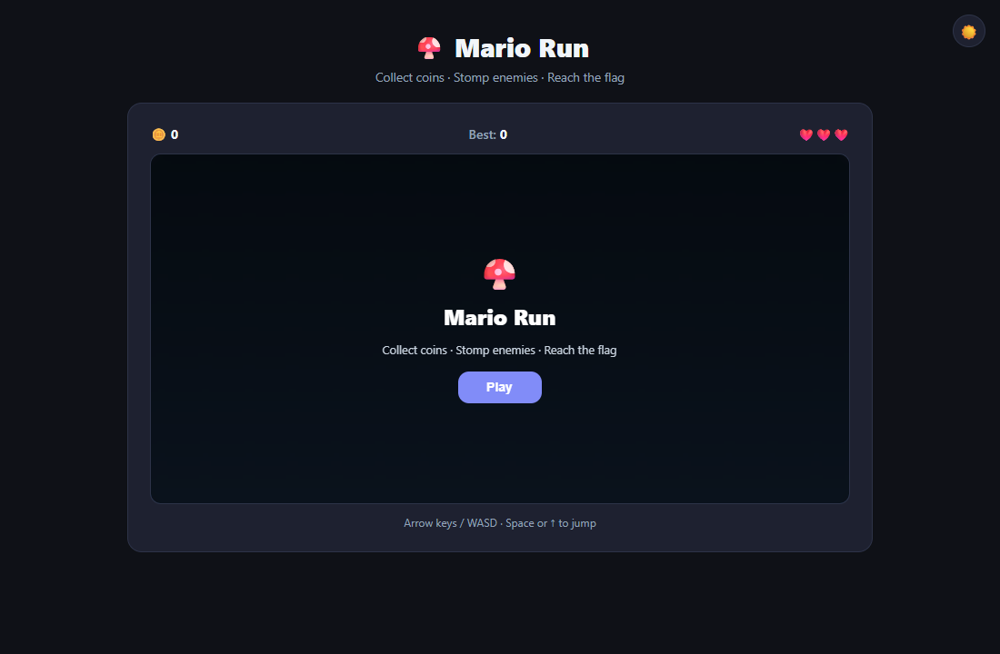

# Mario Run

A side-scrolling canvas platformer built from scratch in **TypeScript** — no game libraries, no engines. Just the HTML5 Canvas 2D API, vanilla physics, and raw math. Run, jump, stomp enemies, collect coins, and reach the flag.

---

## Overview



The game renders entirely on an `800×400` canvas. A scrolling camera follows the player across a 1900 px wide level filled with platforms, enemies, and coins. The HUD sits above the canvas in plain HTML; the overlay (start / game-over / win) floats inside it with CSS.

**Features at a glance:**

| Feature | Detail |
|---|---|
| Physics | Gravity, jump velocity, friction, terminal velocity |
| Collision | AABB platform resolution + circle–rect coin collection |
| Enemies | 6 patrolling Goombas with `minX` / `maxX` bounds |
| Coins | 19 collectibles with bobbing sine-wave animation |
| Camera | Smooth lerp following the player on the X axis |
| Parallax | Clouds scroll at 35 % of camera speed |
| Lives | 3 lives; respawn on death, game-over when exhausted |
| Score | +10 per coin, +100 per stomp; high score in `localStorage` |
| Theme | Full dark/light mode — sky gradient, platforms, and sprites adapt |
| Controls | Keyboard (←→↑ / WASD / Space) + on-screen mobile buttons |

---

## Controls

| Action | Keyboard | Mobile |
|---|---|---|
| Move left | `←` / `A` | ◀ button |
| Move right | `→` / `D` | ▶ button |
| Jump | `↑` / `W` / `Space` | ▲ button |

---

## Architecture

### Module Table

| File | Lines | Responsibility |
|---|---|---|
| `index.html` | — | DOM shell: HUD, canvas, overlay, mobile control buttons |
| `src/mario.ts` | ~470 | All game logic: state machine, physics, collision, rendering, input |
| `src/theme.ts` | ~15 | `initTheme()` — reads `localStorage` + `prefers-color-scheme`; `toggleTheme()` |
| `src/style.css` | ~196 | CSS variables (light/dark), layout, canvas wrapper, overlay, HUD, ctrl buttons |
| `vite.config.ts` | 3 | Minimal Vite config (single `index.html` entry) |

### State Machine

| State | Entered when | Exits to |
|---|---|---|
| `idle` | Page load | `playing` (Play clicked) |
| `playing` | Start / Restart | `gameover` (lives = 0) or `win` (flag reached) |
| `gameover` | Lives reach 0 | `playing` (Try Again clicked) |
| `win` | Player reaches `FLAG_X = 1820` | `playing` (Play Again clicked) |

### Physics Constants

| Constant | Value | Effect |
|---|---|---|
| `GRAVITY` | 0.55 px/frame² | Downward acceleration applied every frame |
| `JUMP_VEL` | −13 px/frame | Upward velocity applied on jump input |
| `MOVE_SPD` | 4.2 px/frame | Horizontal speed while left/right key held |
| Max fall speed | 14 px/frame | Terminal velocity cap |
| Friction | × 0.75 per frame | Applied when no horizontal key is held |

### Level Data

| Element | Count | Notes |
|---|---|---|
| Ground platforms | 4 | Green, span full ground level with gaps between |
| Floating platforms | 8 | Brown brick, at varying heights |
| Coins | 19 | Above floating platforms; +10 score each |
| Enemies | 6 | Each patrols a `minX`–`maxX` range at 1.2 px/frame |
| Level width | 1900 px | Canvas viewport is 800 px; camera scrolls |
| Flag position | x = 1820 | Reaching it triggers `win` state |

### Collision Detection

| Type | Used for | Method |
|---|---|---|
| AABB | Player ↔ platform, Enemy ↔ platform | Overlap depth on both axes; smaller axis resolves |
| Circle–Rect | Player ↔ coin collection | Closest point on rect to circle center |
| Stomp check | Player ↔ enemy (top hit) | `player.vy > 0` AND player feet above enemy top before move |

### Rendering Pipeline (per frame)

| Step | What is drawn |
|---|---|
| 1 | Sky gradient (dark/light mode) |
| 2 | Parallax clouds (`camX × 0.35` offset, tiled) |
| 3 | `ctx.translate(-camX, 0)` — enter world space |
| 4 | All platforms (fill + top highlight + brick lines) |
| 5 | Flag pole + pennant |
| 6 | Uncollected coins (yellow circle, bobbing on sine wave) |
| 7 | Enemies (roundRect body, eyes, eyebrows; squish fade on death) |
| 8 | Player (legs, overalls, shirt, head, hat, eye, mustache) |
| 9 | `ctx.restore()` — return to screen space |

---

## File Structure

```
mario-game/
├── index.html        # Game page
├── vite.config.ts
├── tsconfig.json
├── package.json
├── .gitignore
└── src/
    ├── mario.ts      # All game logic
    ├── theme.ts      # Dark/light mode helpers
    └── style.css     # All styles
```

---

## Getting Started

```bash
npm install
npm run dev       # http://localhost:5173
npm run build     # Output → dist/
npm run preview   # Preview production build
```

**Node.js 18+ required.**
