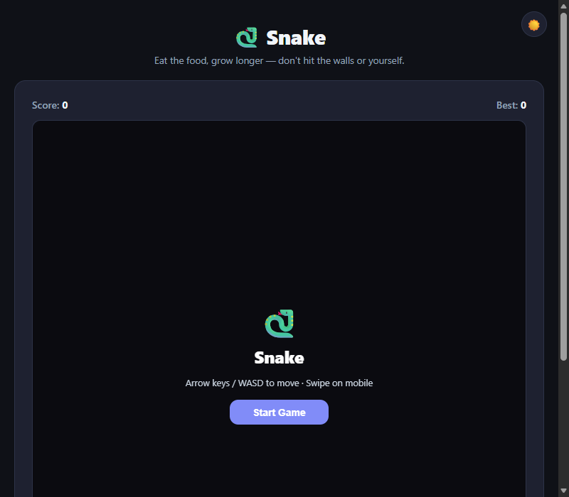

# Snake

A classic Snake game built from scratch in **TypeScript** using the HTML5 Canvas 2D API — no libraries, no frameworks. Eat food to grow longer; avoid the walls and yourself.

---

## Overview



The game runs on a `400×400` canvas divided into a 20×20 grid. Movement is driven by a fixed `setInterval` tick (not `requestAnimationFrame`) so speed is consistent regardless of display frame rate. The HUD and overlay are plain HTML layered on top of the canvas.

**Features at a glance:**

| Feature | Detail |
|---|---|
| Grid | 20×20 cells, 20 px each (400×400 px canvas) |
| Tick rate | 130 ms per step — constant, frame-rate independent |
| Scoring | +1 per food eaten; high score persisted in `localStorage` |
| Food spawn | Always on an empty cell (never overlaps snake body) |
| Tail fade | Body opacity fades linearly from head to tail |
| Head eye | White dot that shifts position based on direction |
| Theme | Full dark/light mode — grid lines and colours adapt |
| Controls | Keyboard (Arrow keys / WASD) + mobile swipe (10 px threshold) |
| Reverse guard | Cannot immediately reverse into opposite direction |

---

## Controls

| Action | Keyboard | Mobile |
|---|---|---|
| Move up | `↑` / `W` | Swipe up |
| Move down | `↓` / `S` | Swipe down |
| Move left | `←` / `A` | Swipe left |
| Move right | `→` / `D` | Swipe right |
| Start / Restart | — | Tap canvas (when idle/gameover) |

---

## Architecture

### Module Table

| File | Lines | Responsibility |
|---|---|---|
| `index.html` | — | DOM shell: HUD, canvas, overlay |
| `src/snake.ts` | ~220 | All game logic: tick loop, state machine, movement, collision, drawing, input |
| `src/theme.ts` | ~15 | `initTheme()` — reads `localStorage` + `prefers-color-scheme`; `toggleTheme()` |
| `src/style.css` | ~196 | CSS variables (light/dark), layout, canvas wrapper, overlay, HUD |
| `vite.config.ts` | 3 | Minimal Vite config (single `index.html` entry) |

### State Machine

| State | Entered when | Exits to |
|---|---|---|
| `idle` | Page load | `playing` (Start Game clicked) |
| `playing` | Start / Restart | `gameover` (wall or self collision) |
| `gameover` | Wall or self hit | `playing` (Play Again clicked / canvas tap) |

### Core Constants

| Constant | Value | Meaning |
|---|---|---|
| `CELL` | 20 px | Width and height of one grid cell |
| `COLS` | 20 | Number of grid columns |
| `ROWS` | 20 | Number of grid rows |
| `SIZE` | 400 px | Canvas dimension (`CELL × COLS`) |
| Tick interval | 130 ms | One game step every 130 milliseconds |

### Direction System

| Rule | Detail |
|---|---|
| Type | `'UP' \| 'DOWN' \| 'LEFT' \| 'RIGHT'` |
| Double-input guard | Input sets `nextDirection`; `direction` updates only at tick start |
| Reverse prevention | Input equal to `OPPOSITE[direction]` is silently dropped |

### Collision Rules

| Collision | Condition | Result |
|---|---|---|
| Wall | `next.x < 0` or `next.x >= COLS` or `next.y < 0` or `next.y >= ROWS` | Game over |
| Self | `snake.some(p => p.x === next.x && p.y === next.y)` | Game over |
| Food | `next.x === food.x && next.y === food.y` | Score +1, snake grows, new food spawns |

### Rendering Details

| Element | How it is drawn |
|---|---|
| Background | Solid fill (`--color-bg`) |
| Grid lines | 0.5 px lines at low opacity (adapts to dark/light) |
| Food | Red circle (`arc`) centred in cell |
| Body segments | Rounded rectangles via `quadraticCurveTo`; opacity = `max(0.25, 1 − (i / len) × 0.75)` |
| Head | Same as body but full opacity + bright green (`#22c55e`) |
| Eye | White `arc`; X position shifts left/right based on direction |
| Canvas scaling | `width: 100%; height: auto` + `image-rendering: pixelated` — crisp at any size |

### Mobile Swipe Logic

| Step | Detail |
|---|---|
| `touchstart` | Records `(touchX, touchY)` |
| `touchend` | Computes `(dx, dy)` |
| Tap guard | If `|dx| < 10` and `|dy| < 10` — treated as tap, not swipe |
| Axis resolve | `|dx| > |dy|` → horizontal (RIGHT/LEFT); else vertical (DOWN/UP) |
| Reverse guard | Result must not equal `OPPOSITE[direction]` |
| Idle tap | If state is not `playing`, tap triggers `startGame()` |

---

## File Structure

```
snake-game/
├── index.html        # Game page
├── vite.config.ts
├── tsconfig.json
├── package.json
├── .gitignore
└── src/
    ├── snake.ts      # All game logic
    ├── theme.ts      # Dark/light mode helpers
    └── style.css     # All styles
```

---

## Getting Started

```bash
npm install
npm run dev       # http://localhost:5173
npm run build     # Output → dist/
npm run preview   # Preview production build
```

**Node.js 18+ required.**
